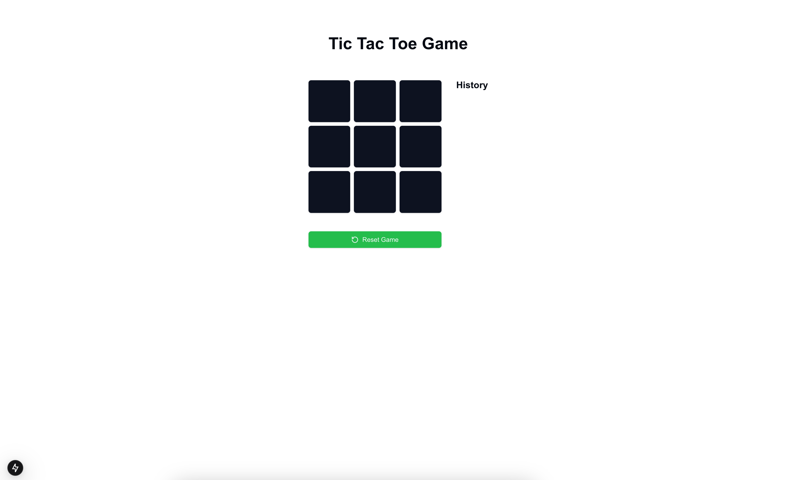

# Tic-Tac-Toe Game



A modern implementation of the classic Tic-Tac-Toe game built with Next.js, React, TypeScript, and Tailwind CSS.

## Features

- Interactive game board
- Modern and responsive UI
- Built with TypeScript for type safety
- State management using Zustand
- Styled with Tailwind CSS and Radix UI components

## Tech Stack

- **Framework:** Next.js 15.1.5
- **Language:** TypeScript
- **Styling:** Tailwind CSS
- **State Management:** Zustand
- **UI Components:** Radix UI
- **Development Tools:**
  - ESLint
  - TurboPack
  - PostCSS

## Getting Started

### Prerequisites

- Node.js (Latest LTS version recommended)
- npm or yarn or bun package manager

### Installation

1. Clone the repository:

```bash
git clone git@github.com:farasjibran/tic-tac-toe-nextjs.git
cd tic-tac-toe
```

2. Install dependencies:

```bash
bun install
# or
npm install
# or
yarn install
```

3. Run the development server:

```bash
bun dev
# or
npm run dev
# or
yarn dev
```

4. Open [http://localhost:3000](http://localhost:3000) with your browser to play the game.

## Project Structure

```
tic-tac-toe/
├── src/
│   ├── app/              # Next.js app directory
│   ├── components/       # React components
│   │   ├── custom/      # Game-specific components
│   │   └── ui/          # Reusable UI components
│   ├── hooks/           # Custom React hooks
│   └── lib/             # Utility functions
├── public/              # Static files
└── ...config files
```

## Scripts

- `dev` - Run development server with TurboPack
- `build` - Build the application for production
- `start` - Start the production server
- `lint` - Run ESLint for code linting

## License

This project is open source and available under the MIT license.
